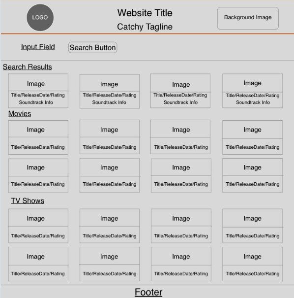
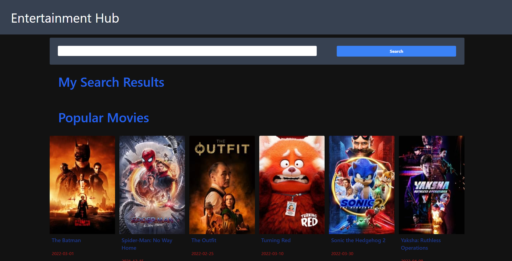
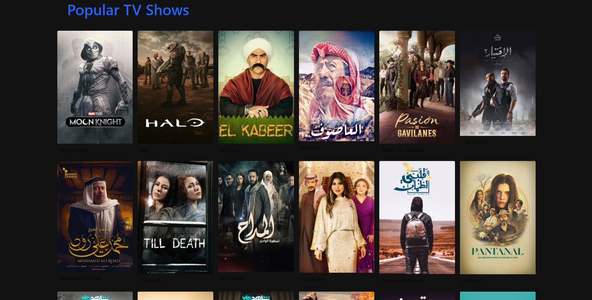
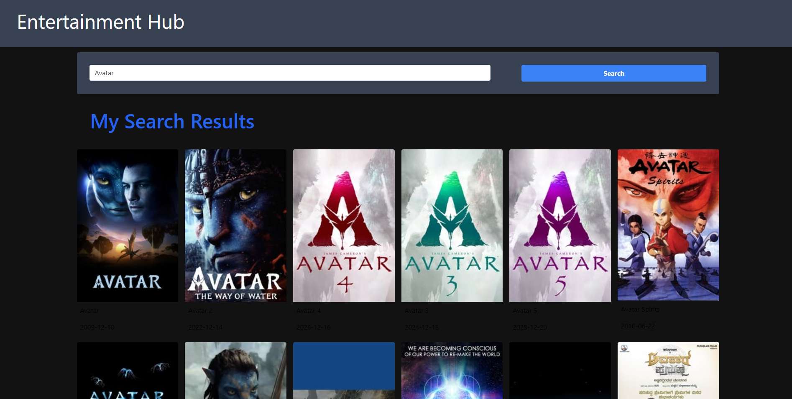
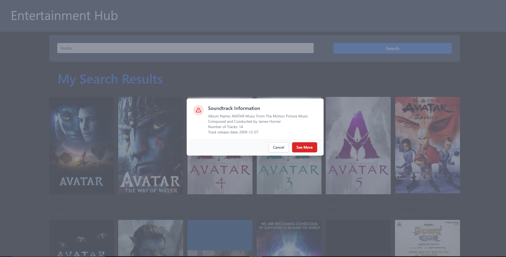
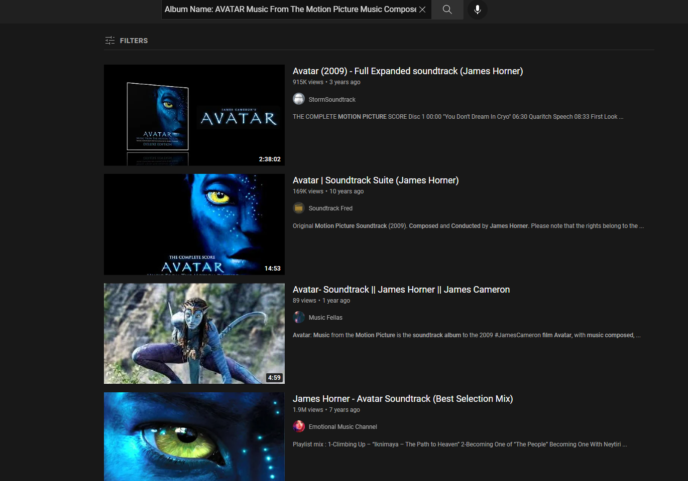

# Entertainment-Hub

## Team Members Credits

Zhunn Altmark: https://github.com/hkhalfan1979/entertainment-hub/tree/Zhunn

Jonathan Clark: https://github.com/hkhalfan1979/entertainment-hub/tree/ClarkJon969

Leelai Hayslett: https://github.com/hkhalfan1979/entertainment-hub/tree/Leelai

Hasnain Khalfan: https://github.com/hkhalfan1979/entertainment-hub/tree/hasnain

Sydnee Peebles: https://github.com/hkhalfan1979/entertainment-hub/tree/speebles

## Description 

The purpose of our application is to merge two seperate API's (Application Program Interface) so the user can have access to detailed information, from the movie/tv show down to the very album information that is present within the movie. We took this concept and utilized the Spotify API and Movie/TV Show DB API to interact with each in our code. The goal was to display the data from each individual API through the users click interaction. After the user searchs a movie (or TV show), results related to their search criteria is displayed. By clicking on the cinematic piece, the user is then presented with album information pertaining to that movie (in pop up form). Furthermore to gain more access to more interactive music/video aspects we provided a redirect in the pop up.

## Proposal

Most streaming websites allow their users to watch select tv shows and movies. But an element that most of these websites lack are a musical aspect. By integrating movie/tv show api with the well known spotify api, we want to allow users to find the album from said movie/tvshow. We plan for the users easy accessability to info on their favorite cinematics down to the music for an in-depth interaction. 

## Table of Contents
- [Wireframe](#wireframe)
- [Website Launch](#website)
- [Github Link](#github-link)
- [Usage](#usage)
- [Challenges](#challenges)
- [Third Party Assets](#third-party-assets)
## Website

https://hkhalfan1979.github.io/entertainment-hub/

## GitHub Link

https://github.com/hkhalfan1979/entertainment-hub

## Wireframe

## Usage

Landing Page: Popular Movies


Landing Page: Popular TV Shows


Searched Results:


On Click Music Information Modal:


See More Redirect to Youtube Webpage:



## Challenges

The most challenging part of this project was pulling information from the API and displaying them. Gaining authentication access from Spotify was tough, but with some work we were able to pull the album name, date the album was released, and the total tracks from the api. In the future this project could potentially provide more data to the user such as: 
-Allowing the user to see more music information .
-Being able to directly select and listen to a song from the album.
-Provide the user with app locations such as Netflix, Hulu, HBO, ect. to watch a selected movie or tv show.
-Expand the cinematic selections (add another API) to movies and tv shows outside of mostly western culture such as anime, k-dramas. european films, ect.

## Third-Party-Assets
```
Spotify

Movie DB

Youtube

Tailwind
```